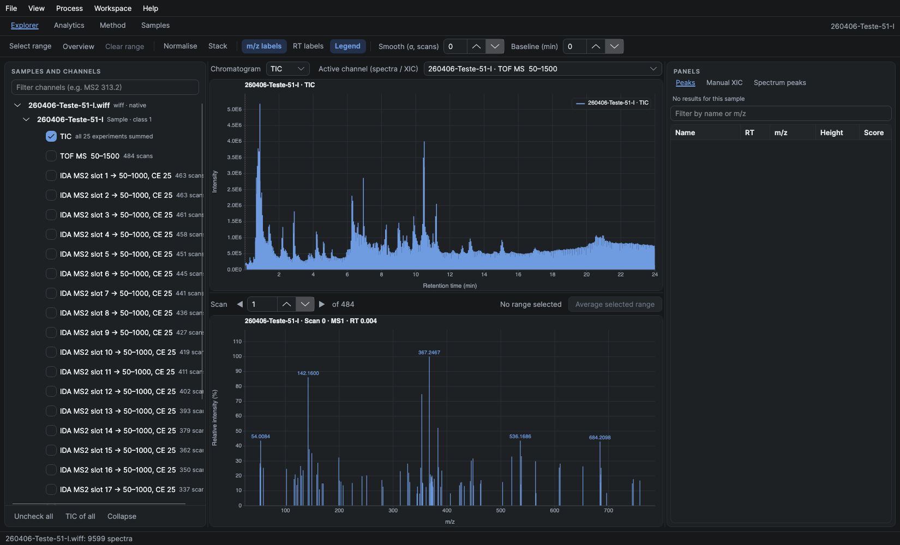

# SCIEX IDA (.wiff) read the way MS-DIAL reads it

IDA is what SCIEX calls data-dependent acquisition. It is the format most of this project's
validation data uses, and three details of it decide whether MIL-X reproduces a Windows
MS-DIAL run. All three were found by reading a real ZenoTOF 7600 acquisition through the
Clearcore2 API with `tools/WiffProbe`, and each is verified against an MS-DIAL 5.5 result set
processed from the same files on Windows.

## How the acquisition is laid out

A ZenoTOF IDA method here holds 25 experiments and 484 cycles:

| Experiment | `IDAType` | `ExperimentType` | Mass range | Meaning |
| --- | --- | --- | --- | --- |
| 0 | Survey | MS | 50–1500 | the TOF MS survey scan |
| 1 … 24 | Dependent | Product | 50–1000 | product-ion slots, filled per cycle |

Every experiment of a cycle reports the same retention time, so a reader that sorts by retention
time and then by MS level lands the survey scan of a cycle ahead of that cycle's product spectra,
which is the order MS-DIAL expects. Of the 11 616 dependent slots in a file, about 9 100 are
actually triggered; the rest hold no data points and no precursor.

The Explorer names the channels from the data, so a correctly read IDA file shows one survey
channel and 24 dependent slots whose scan counts fall off as the later slots trigger less often:

## 1. The precursor of a dependent experiment is per scan, not per experiment

Each dependent experiment still declares a `FragmentBasedScanMassRange` with `FixedMasses` and an
`IsolationWindow`. `FixedMasses` is only the placeholder the acquisition method was written with —
**the same value in all 24 dependent experiments** (829.5 in this dataset). A reader that trusts it
reports one identical precursor for every channel, which is what the Explorer showed before this
was fixed.

The precursor that was actually isolated is on the spectrum: `MassSpectrumInfo.ParentMZ`, at full
precision, different in nearly every cycle (450 distinct values over 484 cycles in one experiment).
`ClearcoreReader` now ignores `FixedMasses` whenever `IDAType` is `Dependent` or `Confirmation`, and
keeps it for SWATH windows and genuine fixed product-ion scans. `Ida_dependent_experiments_carry_a_precursor_per_scan`
guards this.

## 2. Profile spectra must be centroided by SCIEX, not by MS-DIAL's generic method

The data is profile (`CentroidMode` is false), so someone has to centroid it. MS-DIAL's own
`SpectralCentroiding.CentroidByLocalMaximumMethod` takes the highest sampled point of each profile
peak. SCIEX's spectral peak finder, reached through `MSExperiment.GetPeakArray(cycle)`, fits the
peak and reports the fitted apex, which sits about a quarter higher:

| One survey scan | profile points | centroids | intensity vs SCIEX |
| --- | --- | --- | --- |
| SCIEX `GetPeakArray` | 75 494 | 8 875 | 1.00 |
| MS-DIAL local maximum | 75 494 | 11 375 | 0.79 |

Peak heights feed the minimum-peak-height cut-off, so the choice moves the result: with the generic
method the chromatographic peak heights came out at 0.85 of MS-DIAL's and about 250 peaks per sample
fell under the 1 000 threshold. With the vendor's centroider the height ratio is 1.000 (10th–90th
percentile 0.997–1.004). `MILX_WIFF_CENTROID` selects the behaviour: `sciex` (default),
`msdial`, or `0` to keep profile data.

The vendor peak finder reaches into the .NET Framework configuration stack, so the plugin ships
`System.Configuration.ConfigurationManager` and friends beside it, and `RawReaderPlugins` now probes
a plugin's own folder when the runtime cannot resolve an assembly. Without that probing the call
fails and the reader silently falls back to local-maximum centroiding — it logs one line when it does.

## 3. Each analysis file needs an acquisition type

MS-DIAL collects the product spectra of a peak differently depending on `AnalysisFileBean.AcquisitionType`:
DDA requires the precursor to sit within the centroid tolerance of the peak's m/z, while SWATH and
AIF accept anything inside the isolation window. The console's file-list importer sets the field,
but its folder importer left it `None`; `upstream-patches` now fills it from the project's
acquisition type.

Worth knowing when comparing against a Windows project: MS-DIAL 5.5 marked every file of this IDA
dataset as **SWATH**, not DDA. That is why its MS/MS assignment is the looser, isolation-window one.
Running MIL-X with `Acquisition type: DDA` on the same data assigns MS/MS to 897 peaks; with
`SWATH`, to 1 218, against MS-DIAL's 1 206.

## Where this lands

Eight ZenoTOF 7600 injections, MS-DIAL 5.5 on Windows against MIL-X on macOS with the parameter
export converted by `tools/msdial_param_to_method.py`, compared with `tools/ResultCompare`:

| | MS-DIAL | MIL-X |
| --- | --- | --- |
| peaks, all samples | 9 852 | 9 981 |
| peaks matched, first sample | — | 1 889 of 1 906 |
| peak height ratio | — | 1.000 |
| peaks carrying MS/MS, first sample | 1 206 | 1 218 |
| aligned features | 1 731 | 1 611 |
| aligned features matched | — | 1 462 |

## Annotation naming, and why the two runs still disagree

The lipid name a result carries is not the library record's name. MS-DIAL rewrites it from the
fragments it observed (`MsReferenceScorer.ValidateOnLipidomics`), so the same record becomes
`LPC 16:0` at species level and `LPC 16:0/0:0` once a chain is supported. MIL-X runs that same
upstream code, and it agrees: of the 1 462 aligned features the two runs share, exactly **3** carry
a different name while both sides scored the *same* library record, and those three flip in both
directions (one run says `LPC 16:0`, the other `LPC 16:0/0:0`, and on the next feature they swap).
There is no naming rule left to port.

What does differ is which record is scored, and that traces to the library. The reference project
registers its database as `POS_GLDB_260406_2`, which is not the `Pos_GLDB_v0-1-0-alpha.msp` used
here. `ResultCompare --check-library <project> <library.msp>` asks whether a library could have
produced a run's annotations at all, by mass rather than by name:

| Run | annotations | with no record within 0.01 Da in `Pos_GLDB_v0-1-0-alpha.msp` |
| --- | --- | --- |
| MS-DIAL, April | 4 007 | 1 681 (42 %) |
| MIL-X, this library | 2 613 | 255 (10 %) |

Two out of five MS-DIAL annotations are at masses this library cannot reach. `NAE 12:0` and
`NAE 18:2`, which it assigned, are absent from the file altogether; `MG 6:0` is present but at
208.15433 while MS-DIAL assigned it to a peak at 208.17080, sixteen millidaltons away.

That difference then propagates. The representative injection of an aligned feature is the one with
the highest total match score (`DataObjConverter.GetRepresentativePeak`), so different library
scores move it: the two runs pick the same injection for only 328 of the 1 462 shared features, and
566 of the 674 name disagreements are features whose name comes from a different injection.

To compare annotation properly, point MIL-X at the same library build the Windows project used.
Peak detection, MS/MS assignment and deconvolution do not depend on it and already agree: the
deconvoluted MS/MS spectra of shared peaks match one for one, with a peak-count and base-peak ratio
of 1.000 at both the 10th and 90th percentile.
