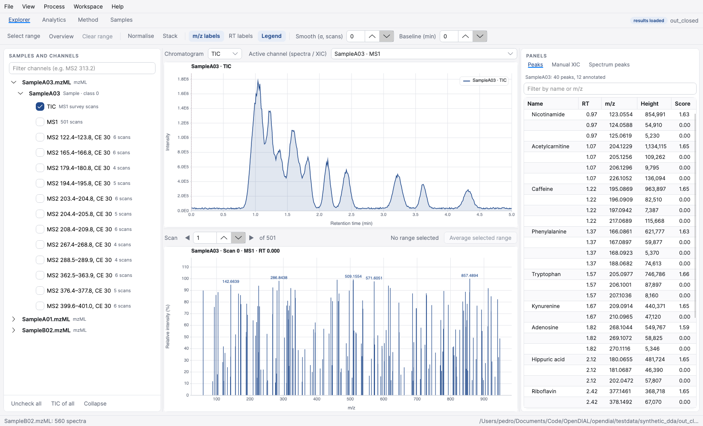
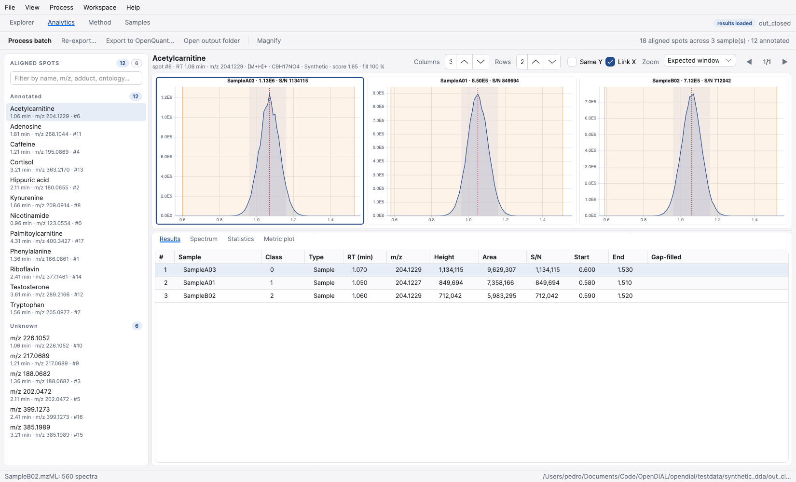
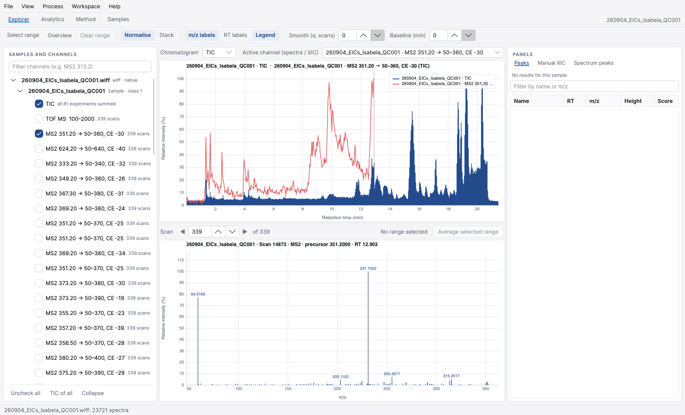

# OpenDIAL — MS-DIAL 5 for macOS (and Linux)

OpenDIAL is an open, cross-platform port of [MS-DIAL 5](https://github.com/systemsomicslab/MsdialWorkbench)
(untargeted metabolomics / lipidomics data processing, LGPL-3.0). The MS-DIAL engine is used
unchanged; the Windows-only pieces are replaced:

* **`OpenDIAL.RawData`** – an open raw-data layer that is a drop-in replacement for the closed
  `RawDataHandler` package: native mzML reader, **native SCIEX `.wiff`** (Clearcore2 plugin, the
  same route OpenQuant uses), other vendor formats (Thermo `.raw`, Agilent/Bruker `.d`,
  Shimadzu `.lcd`) through a ProteoWizard *msconvert* bridge, optional reflection bridge to the
  original dll for `.ibf`/`.cdf`/`.imzML`.
* **`MSDIALCUI` console** – built and published as a self-contained macOS ARM64/x64 or Linux binary.
* **`OpenDIAL.Desktop`** – a new Avalonia desktop application that shares OpenQuant's design language
  and shell (Explorer / Analytics / Method / Samples workspaces, same palette, light and dark).
* **`OpenDIAL.Interop.OpenQuant`** – export aligned features as an OpenQuant component table and import
  an OpenQuant `.oqproj` batch, so discovery in OpenDIAL flows into targeted quantitation in OpenQuant.
* **`OpenDIAL.Pipeline`** – headless orchestration library shared by the GUI and tests.

Everything is verified end to end on Apple Silicon with a synthetic LC-MS/MS DDA study
(`tools/make_synthetic_mzml.py`): 12/12 compounds annotated, alignment across 3 samples,
identical results to the Windows reader.

```bash
bash opendial/scripts/setup-macos.sh     # .NET 8 SDK (no sudo) + NuGet source
bash opendial/scripts/build-cli.sh       # -> opendial/dist/opendial-cli-osx-arm64/opendial-cli
bash opendial/scripts/test.sh            # unit tests + end-to-end synthetic run
dotnet run --project opendial/src/OpenDIAL.Desktop -c Release -p:UseOpenRawData=true   # GUI (or scripts/build-gui.sh)
```





A TripleTOF `.wiff` opened natively in the Explorer:



Documentation: [docs/ARCHITECTURE.md](docs/ARCHITECTURE.md) (reverse-engineering report),
[docs/PORTING.md](docs/PORTING.md) (status, vendor formats, limitations),
[docs/OPENQUANT-ALIGNMENT.md](docs/OPENQUANT-ALIGNMENT.md) (what is shared with OpenQuant),
[docs/adr/](docs/adr/) (decisions), [upstream-patches/](upstream-patches/README.md)
(the four upstream changes).

OpenDIAL is not affiliated with RIKEN or the MS-DIAL authors. Please cite MS-DIAL when you use it.
