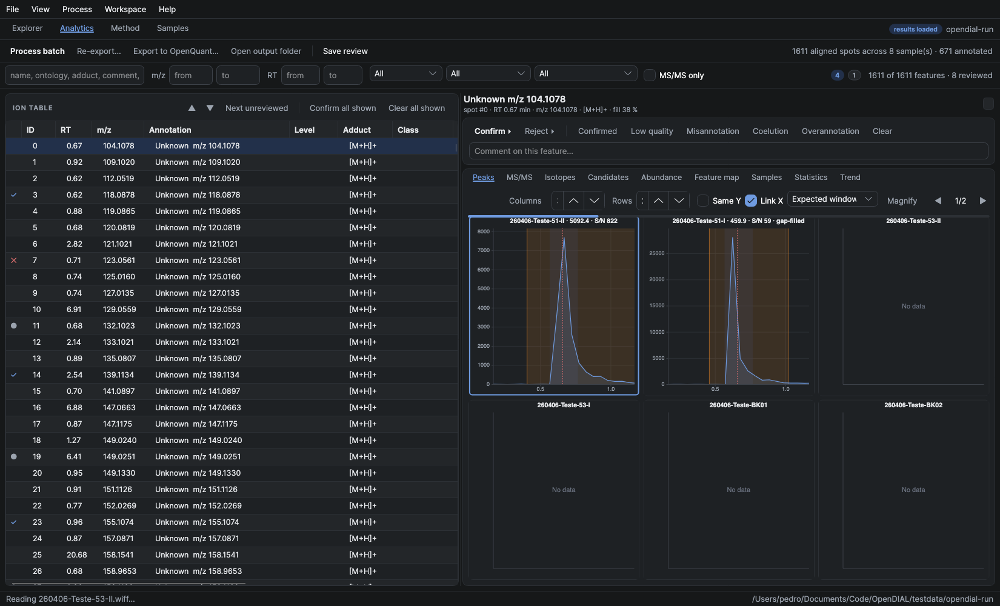
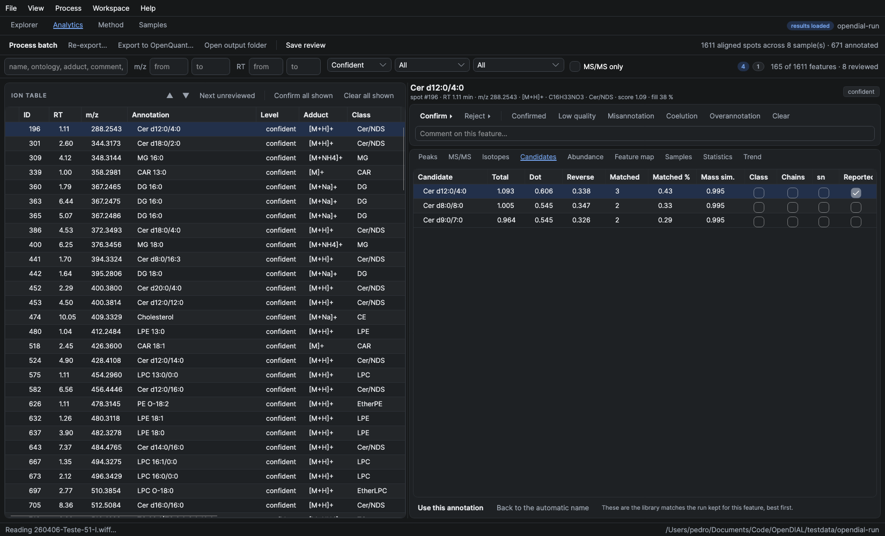
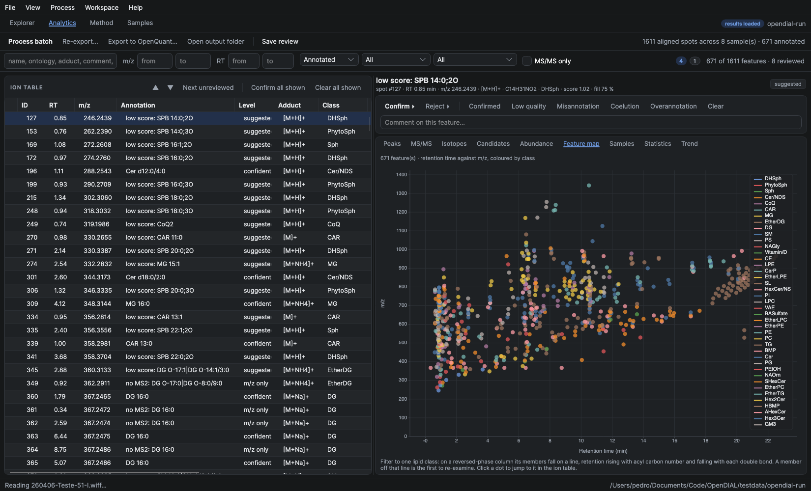

# Reviewing a run: the Analytics workspace

Processing a lipidomics batch produces a few thousand aligned features, most of them wrong in some
way. What turns that into a result is the review pass, and MS-DIAL's is the one analysts know. This
workspace follows it: the ion table is the spine, the evidence for the selected feature is beside
it, and the verdict is one keystroke away.

## The ion table

Every aligned feature, sortable on any column: id, retention time, m/z, annotation, confidence
level, adduct, lipid class, fill percentage, whether MS/MS was assigned, signal-to-noise, match
score, mean height, tags and comment. The leftmost column is the verdict at a glance — a tick for
Confirmed, a cross for Misannotation, a dot for anything flagged to come back to.

The filter band above it narrows the table and everything downstream of it:

| Filter | What it is for |
| --- | --- |
| free text | name, ontology, adduct, formula, comment or feature id |
| m/z from–to, RT from–to | the region of the map you are working through |
| annotation | all, confident, suggested, annotated, unknown |
| class | one lipid class at a time, which is how a class-by-class pass runs |
| review state | untagged, reviewed, not reviewed, or one specific tag |
| MS/MS only | drop the features annotated on mass alone |

## The verdict

The five flags are MS-DIAL's own, with the same names and the same numeric ids:

| Key | Tag | Means |
| --- | --- | --- |
| Ctrl+1 | Confirmed | checked, and right |
| Ctrl+2 | Low quality spectrum | too weak or noisy to judge |
| Ctrl+3 | Misannotation | the name is wrong |
| Ctrl+4 | Coelution (mixed spectra) | two compounds under one peak |
| Ctrl+5 | Overannotation | an isotope, adduct or in-source fragment of something else, or a name claiming more than the spectrum shows |

They are not exclusive: a feature can be both Coelution and Overannotation. `Confirm ▸` and
`Reject ▸` set the obvious one and move to the next feature, which is the whole of a fast pass;
`Next unreviewed` skips what is already decided. `Confirm all shown` applies the verdict to
everything the filter is showing, which is how a whole lipid class gets accepted once its retention
trend checks out.

**The review is written to `<alignment>_tags.xml`, the file MS-DIAL reads and writes.** Curation
done on Windows shows up here, and curation done here shows up there. Comments, a hand-picked
annotation and the reviewed flag are OpenDIAL's own additions and go to a sibling
`<alignment>_curation.json`, so the binary alignment files are never rewritten.

## The evidence

Eight panels, each answering one question a reviewer actually asks.

**Peaks** — the chromatographic peak in every sample at once, one panel per injection, with the
integration window shaded and gap-filled samples marked. Does the feature exist, is it integrated
the same way everywhere, is it aligned.

**MS/MS** — the deconvoluted product spectrum mirrored against the library reference, with the score
breakdown beside it: dot product, reverse dot product, matched peaks and their percentage, mass and
retention similarity, and which level of lipid evidence was reached (class, chains, or sn-position).

**Isotopes** — the MS1 isotope envelope of the representative sample. An envelope that does not fit
the formula, or a monoisotopic ion that is not the base peak, is the signature of an isotope or
adduct of another feature.

**Candidates** — every library match the run kept for the feature, best first, with the full score
breakdown and ticks for class, chain and sn-position evidence. The one the run reported is marked.
`Use this annotation` replaces it with another; `Back to the automatic name` undoes that.

**Abundance** — one bar per injection, coloured by class. A feature as high in the blanks as in the
samples is background; one that scatters across the quality-control injections is not quantifiable.

**Feature map** — every filtered feature as a dot in retention time against m/z, coloured by class.
Filter to one class and its members fall on a line: retention rises with acyl carbon number and
falls with each double bond. A member off that line is the first to re-examine. Clicking a dot jumps
to it in the ion table.

**Samples**, **Statistics**, **Trend** — the per-sample numbers, the per-class mean, standard
deviation and %CV, and any metric against injection order for a drift check.

## What is not here yet

Manual re-integration of a peak (MS-DIAL's peak-curation window), splitting one aligned feature into
two for co-eluting isomers, re-searching the library from inside the application with different
tolerances, and the statistics windows (principal components, clustering, molecular networking).
The candidate list covers the common case of the automatic annotation picking the wrong record,
which is what re-searching is usually for.
