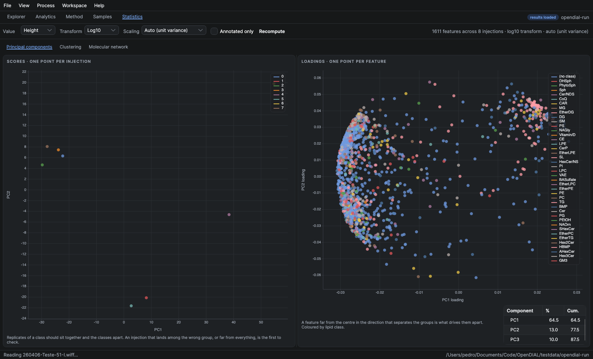
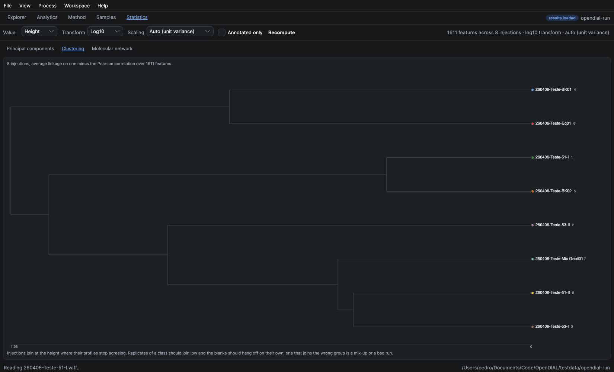
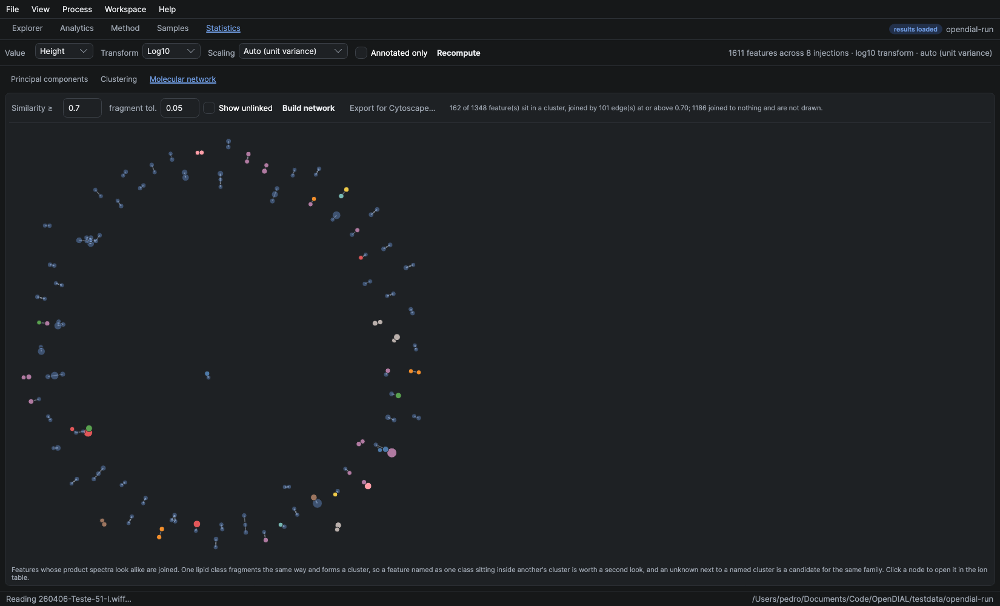

# The Statistics workspace

Review works one feature at a time. This workspace is the other half: the dataset seen whole, so a
mislabelled injection, a batch that drifted or a class that fragments alike shows up before the
per-feature work starts.

One options band drives all three readings, because they are three readings of the same matrix:

| Option | What it changes |
| --- | --- |
| value | peak height or peak area |
| transform | log10, the usual choice, or none |
| scaling | unit variance gives every feature the same weight; Pareto is between; centre only lets the abundant ones lead |
| annotated only | drop the unknowns before computing |

Missing and non-positive values become the smallest positive value of their own feature, which is
what a log transform needs and what most pipelines do.

## Principal components

Scores on the left, one point per injection, coloured by class: replicates of a class should sit
together and the classes apart, and an injection that lands among the wrong group or far from
everything is the first to check. Loadings on the right, one point per feature, coloured by lipid
class: a feature far from the centre in the direction that separates the groups is what drives them
apart. The table gives the variance each component carries and the running total.

A metabolomics matrix has far more features than injections, so the components come from the
injection-by-injection Gram matrix rather than the feature covariance. With eight injections that is
an 8×8 eigenproblem instead of a 1600×1600 one, and it gives exactly the same components.

## Clustering

Average linkage over one minus the Pearson correlation of the injection profiles. Two injections
join at the height where their profiles stop agreeing, so replicates should join low and the blanks
should hang off on their own. One that joins the wrong group is a mix-up or a bad run.

## Molecular network

Features whose deconvoluted product spectra look alike are joined, by the intensity-weighted cosine
over matched fragments that MS-DIAL and GNPS both use. One lipid class fragments the same way and
forms a cluster, so a feature named as one class sitting inside another's cluster is worth a second
look, and an unknown next to a named cluster is a candidate for the same family. Clicking a node
opens that feature in the ion table.

Features joined to nothing are counted but not drawn: with a few thousand of them the picture is
all singletons and no clusters. `Show unlinked` puts them back. `Export for Cytoscape` writes the
node and edge tables.

The similarity cut-off and the fragment tolerance are yours to set. Building the network reads every
deconvoluted spectrum, so it is a button rather than something that happens on every option change.

## What is not here

Supervised methods — partial least squares and its discriminant and orthogonal variants — and batch
correction. Both need a design the application does not ask for yet: which injections are the
quality controls, what the batches are, and what the response is.
